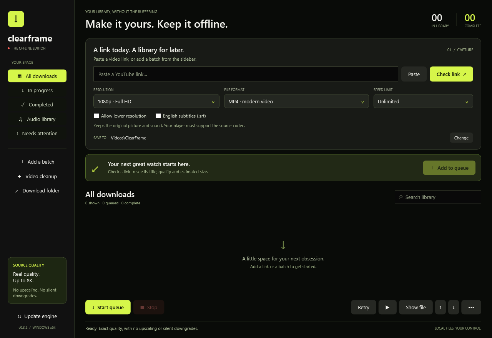

# ClearFrame

A portable Windows desktop app for saving YouTube video and audio to your own library. Built with C# and WPF, with a black interface, lemon-lime accents, and explicit quality controls.

[](https://github.com/spade-codee/clearframe/actions/workflows/ci.yml)
[](LICENSE)



## Features

- Video: 360p to 8K, plus the best available source resolution. No upscaling or silent quality downgrade.
- Formats: MP4, MKV, WebM and MOV; audio-only MP3 and M4A.
- Batches of up to 100 individual YouTube links, with validation and deduplication.
- Searchable library, status filters, queue ordering, retry-all, playback and saved preferences.
- Automatic download-history backup recovery, with damaged-file preservation and visible save errors.
- Optional subtitles, bandwidth limits and automatic video/audio merging.
- Verification of saved media streams, resolution and duration.
- Local-video cleanup: select a fixed logo/text region to blend or blur, or crop away an edge. Compare original and edited frames instantly, then export a separate MP4.

Higher quality and codecs depend on what the source offers. This is an early `0.x` release; complete UI-driven restart/resume testing is still outstanding.

## Download and run

1. Download the Windows x64 app ZIP from [Releases](https://github.com/spade-codee/clearframe/releases).
2. Extract the entire ZIP to a writable folder.
3. In PowerShell 7, open that folder and run `./Get-Tools.ps1`. This downloads yt-dlp, Deno and FFmpeg directly from their upstream GitHub releases and verifies the pinned SHA-256 hashes.
4. Run `ClearFrame.exe`.

The public release ZIP contains the application and tool installer; the third-party executables are downloaded separately. No administrator access is required. Requires Windows 10/11 x64 and .NET Framework 4.7.2 or newer. The executable is unsigned.

See the [user guide](docs/USER-GUIDE.md) for quality selection, audio conversion and queue controls. Only save content you have permission to download. ClearFrame is not affiliated with YouTube or Google.

## Build and test

Use PowerShell 7 on Windows with .NET Framework 4.7.2+:

```powershell
git clone https://github.com/spade-codee/clearframe.git
cd clearframe
./scripts/Build.ps1
./scripts/Test.ps1
./scripts/Get-Tools.ps1
./dist/ClearFrame/ClearFrame.exe
```

The build uses the C# compiler included with .NET Framework. No .NET SDK or NuGet packages are needed. Automated tests are offline and do not download YouTube media. Tests write results and UI renders to `artifacts/`.

After tool setup, run `./scripts/Test.ps1 -MediaTools ./dist/ClearFrame/tools` for optional synthetic-video export checks. See [video cleanup](docs/VIDEO-CLEANUP.md) for the editor's workflow and limits. Blending cannot reliably restore detail covered by an embedded logo.

## Versioning and releases

[`VERSION`](VERSION) is the source of truth for the application version. Builds generate assembly metadata and the Windows manifest from it. [CHANGELOG.md](CHANGELOG.md) records changes. Releases are tagged `vMAJOR.MINOR.PATCH`.

Tag pushes run the Windows build and tests, check that the tag matches `VERSION`, and publish an application ZIP with a SHA-256 checksum. See [the release guide](docs/RELEASING.md).

## Project layout

```text
source/       C# application, WPF interface, icon and manifest template
scripts/      Build, test, dependency setup and packaging
tests/        Offline subprocess test helpers
config/       Pinned tool releases and SHA-256 hashes
docs/         User guide, screenshot, test limits and release process
.github/      CI, tagged releases and contribution templates
```

## Contributing and licensing

See [CONTRIBUTING.md](CONTRIBUTING.md), [SECURITY.md](SECURITY.md) and [the roadmap](docs/ROADMAP.md).

ClearFrame's application code is [MIT licensed](LICENSE). yt-dlp, FFmpeg, Deno and their dependencies retain their own licenses; see [THIRD-PARTY.md](THIRD-PARTY.md). They are invoked as separate programs and their binaries are excluded from this repository and its application release ZIP.
