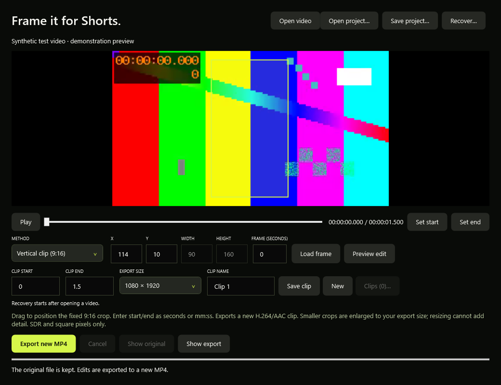
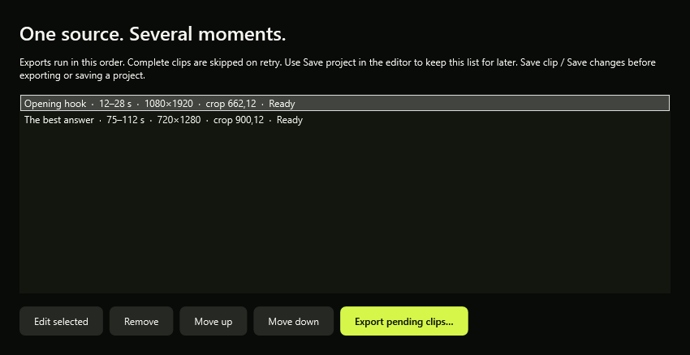

# Vertical clips for Shorts and TikTok

Turn a local video into a separate 9:16 MP4. Download your source once, then reuse it for several clips.

1. Finish or stop the queue, then choose **••• > Create a vertical clip (9:16)…**.
2. Choose **Open video** and select your local video.
3. Enter **Clip start** and **Clip end** in seconds, `mm:ss` or `hh:mm:ss`. The range must be at least one second and stay within the video. Changing the start also sets the preview frame time; select **Load frame** to refresh it.
4. Drag on the original frame to position the lemon-colored crop. The rectangle stays at a fixed 9:16 ratio. Use **X** and **Y** for precise, even-pixel positioning; width and height are calculated automatically.
5. Choose **1080 × 1920** or **720 × 1280**, then **Preview edit**. **Show original / Show edit** compares that frame. Inspect other frame times to check that your subject stays inside the crop.
6. Choose **Export new MP4** and give the clip a new name. ClearFrame checks its dimensions, duration and H.264/AAC format before saving the finished output. **Show export** opens its folder.
7. Change the range or crop and export under another name to create another clip from the same source.

The source and existing files are never overwritten. Cancel stops the export and attempts to remove its temporary output.

## Use the timeline

Drag or click the timeline below the picture. Once you release it and briefly stop seeking, ClearFrame loads a still frame through FFmpeg. **Set start** and **Set end** copy the current position into your clip range. The range must still be at least one second; use the time fields for precise adjustment, then **Save clip / Save changes** to update the batch.

**Play / Pause** uses Windows media decoding for the original video and audio. Pause loads an FFmpeg frame for inspection. Playback shows the original picture with the fixed crop outline; use **Preview edit** to inspect a processed still. Playback is not a live rendered export preview and does not stop at the clip end automatically.

Native playback depends on the codecs and media components installed in Windows. If Windows cannot decode a source, an error explains the limitation and timeline still-frame previews remain available through FFmpeg. You can also use **Convert a video for Windows** to create a compatible copy. Full interactive native playback has not yet been manually verified.

## Export several named clips together

1. Set the range, crop and size for your first clip. Enter a unique **Clip name**, then choose **Save clip**.
2. Choose **New**, adjust the settings and name, then **Save clip** again. A batch can hold up to 50 clips from the open video. Each saved clip keeps its own range, crop position and output size.
3. Choose **Clips (N)…** to review the list. Use **Move up / Move down** to set export order, **Remove** to remove a draft without deleting its exported video, or **Edit selected** to load its settings into the editor. After editing, choose **Save changes**; uncommitted editor changes are not included in the batch.
4. Choose **Export pending clips…** and select an output folder. Filenames use your clip names with `.mp4` appended. Names must be unique regardless of letter case and valid for Windows, with at most 80 characters. Use a short folder path: final output paths are limited to 200 characters to leave room for temporary filenames.
5. ClearFrame validates all pending ranges and target filenames before starting. If any target already exists, rename that clip or choose another folder. It exports sequentially and verifies each clip before publishing its final file.
6. **Cancel** stops the batch and keeps completed clips. If cancelled or stopped by an error, review the list and export again: completed clips are skipped, while ready, cancelled and failed clips are retried. You can select a different folder for those remaining clips. Existing files are never overwritten, including files created by another program after the initial check.

Saving changes to a completed clip makes that revision pending again: rename it or use another folder if its previous output still exists.

## Save a project and continue later

1. Use **Save clip / Save changes** to put your latest editor settings into the list, then choose **Save project** at the top of the editor. Pick a `.cfclips.json` filename. You can also save an empty project after opening a source video.
2. Keep the original video. The project stores its location and fingerprint, plus clip names, order, ranges, crop positions and output sizes. It does **not** embed video, copy exports or save uncommitted changes in the editor fields.
3. Later, open the vertical editor and choose **Open project…**. ClearFrame checks the source file before applying the saved settings. Select **Load frame** to preview the restored first clip.
4. If the source moved, ClearFrame tries the original path, then a same-named file beside the project when the original path is missing. Otherwise, use the file picker to locate the unchanged original. A byte-for-byte copy can be renamed or moved; a re-encoded or modified video will not match. A failed or cancelled open keeps your current clip list.
5. Choose **Save project** again after changing names, ranges, crops or order. An asterisk indicates that the saved clip list differs from the last saved/opened project. Closing or replacing the source also warns about uncommitted editor fields. Project-file saves remain manual; local recovery snapshots provide additional protection as described below.

Project saves and opens read the source to check its fingerprint, so large videos can take time. **Cancel** stops this check. No video upload or network service is involved.

**Every reopened clip starts Ready.** Projects preserve editing settings, not the session's completed/failed/exporting states or output paths. Nothing exports automatically. Choose another destination or new names if earlier exports already exist; existing files are never overwritten. Within an uninterrupted editor session, batch retry still skips completed clips.

Saving over a valid project replaces it atomically and retains the previous version as `.cfclips.json.bak`. **Open project** can read this backup. If a project or its existing backup is damaged, saving over it is refused to preserve the damaged file; save under a new name instead. Unknown project versions, invalid settings and files larger than 1 MB are rejected.

To move a project to another PC, copy both the project and its unchanged source video. The project contains the original source path, including folder names; review that local path before sharing the project publicly.

## Automatic local recovery

While the vertical editor is open, ClearFrame prepares a local recovery snapshot after about two seconds without changes. It waits during previews, exports and other busy operations. The first snapshot checks the whole source file, which can take time for large videos; later snapshots reuse that identity while the file's size and modification time remain unchanged.

The recovery message below the clip controls shows preparation, the last completed save time, or a save error. A snapshot contains the saved clip list **and** your current editor fields, including unfinished text such as a partially typed timestamp. It never overwrites your manual project or video files. Each editor/source session gets a separate snapshot, with its previous version retained as a `.bak` file.

After reopening ClearFrame, choose **••• > Create a vertical clip > Recover…**. Select a dated snapshot and **Restore selected**. The source is verified before the current editor state is replaced; you can locate an unchanged source if it moved. Restored clips are Ready, unfinished fields remain available to correct, and no export begins automatically. Review the fields, choose **Save clip / Save changes**, then **Save project** for a portable copy.

Recovery files live in `%LOCALAPPDATA%\ClearFrame\clip-recovery`. The picker shows up to 100 recent primary/backup snapshots. **Open recovery folder** lets you inspect or remove older snapshots after closing the editor. They are retained after normal closure as well as an interrupted session, and contain file paths and clip settings, not video.

Recovery preserves only the **last completed snapshot**. Changes made just before closure/crash, while busy, or before the first source check finishes can be missing. A source change or save error stops that snapshot from being committed and leaves earlier snapshots intact. Corrupt snapshots are preserved; a readable previous snapshot can still be selected. Manual project saves remain useful for keeping and sharing deliberate versions of your work.

## What this version supports

- Local SDR video with even dimensions and square pixels, including common 90-degree rotation metadata. HDR and non-square-pixel sources are rejected with an explanation.
- The largest even-pixel 9:16 crop that fits inside the source, positioned manually. It stays in the same place throughout the clip; it does not track faces or moving subjects.
- H.264 High profile, 8-bit YUV 4:2:0 and AAC LC in MP4. The first audio track is used; silent videos are supported. Extra audio tracks, subtitles, chapters and source metadata are not copied.
- The crop is resized to the chosen output size. A landscape 1080p video contains fewer pixels in its portrait crop, so a 1080×1920 export can involve enlargement. This does not create missing detail. Exports re-encode and can change quality and file size.
- Single exports or batches of up to 50 named clips, saved projects, local recovery, timeline still previews and Windows-dependent original-video playback. Automatic highlights, face tracking, styled captions, a multi-track editing timeline and direct platform uploads are not included.

For full-video codec repair, choose **••• > Convert a video for Windows…**. For fixed logo blending, blur or freeform cropping, see [Video cleanup](VIDEO-CLEANUP.md).
