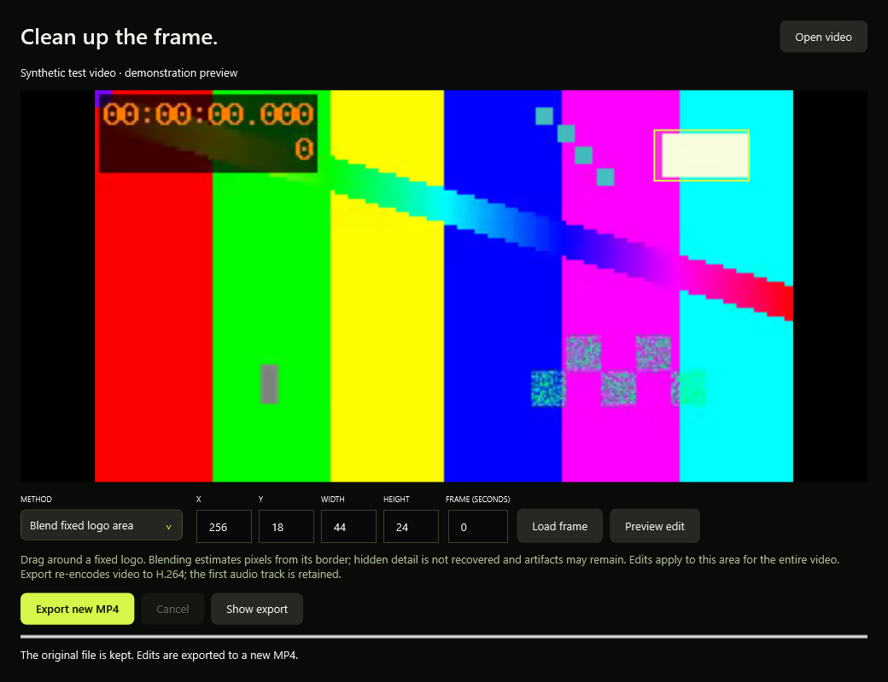

# Video cleanup

ClearFrame never adds watermarks to downloads. This editor handles a logo or text already embedded in a local video, for footage you are entitled to edit.

1. Finish or stop the download queue and choose **Video cleanup** in the sidebar.
2. Open a local SDR video. Choose a frame time in seconds and select **Load frame**.
3. Choose the method and drag a rectangle on the original frame. Numeric X, Y, width and height values are available for precise adjustment. Coordinates and sizes use even pixel values for H.264 compatibility.
4. Select **Preview edit** to inspect that frame. **Load frame** returns to the original for selecting another area.
5. Select **Export new MP4** and choose a new filename. The source and existing output files are not overwritten. Exports are checked for expected dimensions, duration and audio presence.

## Methods

- **Blend fixed logo area** uses FFmpeg's delogo interpolation. Select the whole logo, with surrounding pixels available on each side. A border is required; use crop or blur for a logo touching the frame edge. Hidden detail cannot be recovered reliably, and texture/motion can leave visible artifacts.
- **Blur selected area** obscures the selected rectangle, including regions at a frame edge. It hides detail rather than reconstructing it.
- **Crop to selected area** keeps the selected rectangle and discards everything outside it. This can remove edge logos at the cost of part of the picture.

## Export and limits

- The same fixed rectangle is applied to the entire video. It does not follow moving logos or changing camera layouts.
- Video is re-encoded to H.264, CRF 18, 8-bit YUV 4:2:0 in MP4. This is not lossless and can change file size substantially.
- The first audio track is retained; AAC is copied when possible and other codecs are converted to AAC. Additional audio tracks, embedded subtitles and source metadata are not copied.
- HDR inputs are rejected instead of silently producing an incorrect SDR result. Even pixel dimensions and common 90-degree rotation steps are supported.
- A selected-frame preview does not prove the edit looks good throughout a moving scene. Check representative frame times and inspect the complete export.
- Cancellation removes the editor's temporary output when possible and leaves the input unchanged. A crash can leave a `.partial-...mp4` file beside the chosen destination; it can be removed after the app is closed.
- The local synthetic-media export tests cover the three filters, small edge regions, rotated video, file protection and audio/duration checks. Manual full-editor interaction and every possible codec/container combination remain unverified.
